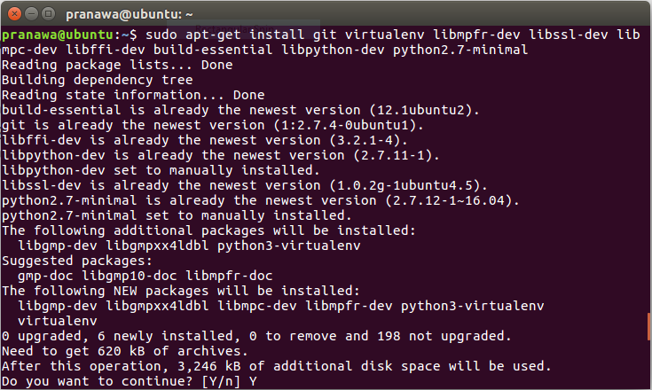
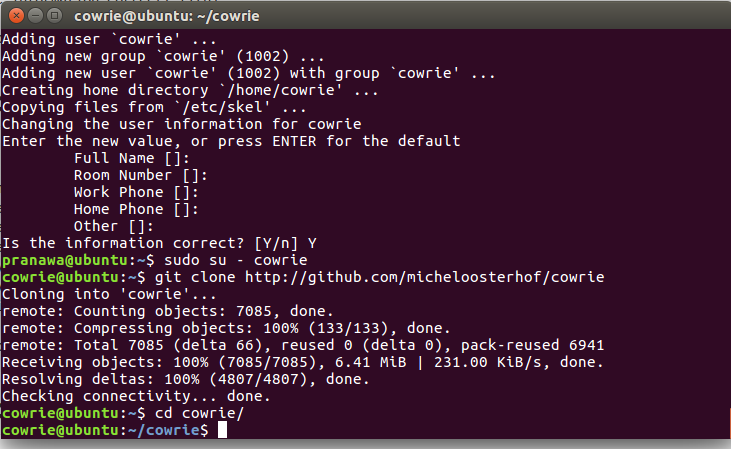
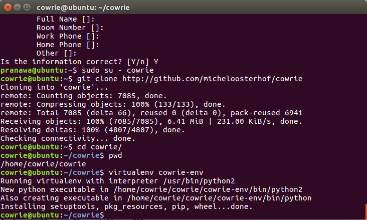
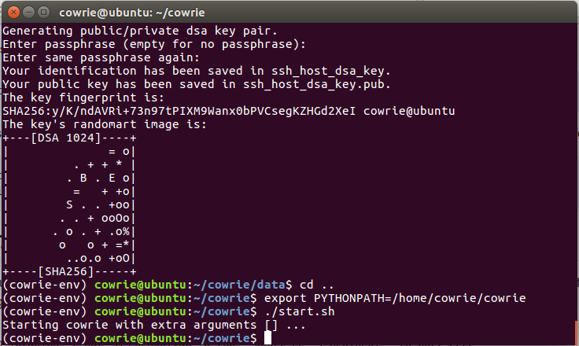

###PENDAHULUAN###

####Cowrie SSH Honeypot###

"Cowrie is a medium interaction SSH and Telnet honeypot designed to log brute force attacks and the shell interaction performed by the attacker."

Cowrie dikembangkan oleh Michel Oosterhof.

####Fitur-fitur Cowrie

1. Fake filesystem with the ability to add/remove files. A full fake filesystem resembling a Debian 5.0 installation is included
1. Possibility of adding fake file contents so the attacker can cat files such as /etc/passwd. Only minimal file contents are included
1. Session logs stored in an UML Compatible format for easy replay with original timings
1. Cowrie saves files downloaded with wget/curl or uploaded with SFTP and scp for later inspection


Additional functionality over standard kippo:

1. SFTP and SCP support for file upload
1. Support for SSH exec commands
1. Logging of direct-tcp connection attempts (ssh proxying)
1. Forward SMTP connections to SMTP Honeypot (e.g. mailoney)
1. Logging in JSON format for easy processing in log management solutions
1. Many, many additional commands
1. Requirements

####Software requirements:####

1. Python 2.7+, (Python 3 not yet supported due to Twisted dependencies)
1. Zope Interface 3.6.0+
1. Twisted 12.0+
1. python-crypto
1. python-cryptography
1. python-pyasn1
1. python-gmpy2 (recommended)
1. python-mysqldb (for MySQL output)
1. python-OpenSSL

###INSTALASI###
####1. Install Dependencies####
```
sudo apt-get install git virtualenv libmpfr-dev libssl-dev libmpc-dev libffi-dev build-essential libpython-dev python2.7-minimal
```


####2. Create User Account####
```
$ sudo adduser --disabled-password cowrie
Adding user `cowrie' ...
Adding new group `cowrie' (1002) ...
Adding new user `cowrie' (1002) with group `cowrie' ...
Changing the user information for cowrie
Enter the new value, or press ENTER for the default
Full Name []:
Room Number []:
Work Phone []:
Home Phone []:
Other []:
Is the information correct? [Y/n]

$ sudo su - cowrie
```


####3. Checkout the Code####
```
$ git clone http://github.com/micheloosterhof/cowrie
Cloning into 'cowrie'...
remote: Counting objects: 2965, done.
remote: Compressing objects: 100% (1025/1025), done.
remote: Total 2965 (delta 1908), reused 2962 (delta 1905), pack-reused 0
Receiving objects: 100% (2965/2965), 3.41 MiB | 2.57 MiB/s, done.
Resolving deltas: 100% (1908/1908), done.
Checking connectivity... done.

$ cd cowrie
```


####4. Setup virtualenv####
```
$ pwd
/home/cowrie/cowrie
$ virtualenv cowrie-env
New python executable in ./cowrie/cowrie-env/bin/python
Installing setuptools, pip, wheel...done.
$ source cowrie-env/bin/activate
(cowrie-env) $ pip install -r requirements.txt
```



####5. Install Configuration File####
```
$ cp cowrie.cfg.dist cowrie.cfg
```


####6. Generate DSA Key####
```
$ cd data
$ ssh-keygen -t dsa -b 1024 -f ssh_host_dsa_key
$ cd ..
```


####7. Start Cowrie####
```
# or whatever path to the top-level cowrie folder
$ export PYTHONPATH=/home/cowrie/cowrie

$ ./start.sh
```

####8. Port Directional####
```
$ sudo iptables -t nat -A PREROUTING -p tcp --dport 22 -j REDIRECT --to-port 2222
```

SSH :
```
$ apt-get install authbind
$ touch /etc/authbind/byport/22
$ chown cowrie:cowrie /etc/authbind/byport/22
$ chmod 770 /etc/authbind/byport/22
```

TELNET :
```
$ apt-get install authbind
$ sudo touch /etc/authbind/byport/23
$ sudo chown cowrie:cowrie /etc/authbind/byport/23
$ sudo chmod 770 /etc/authbind/byport/23
```

Edit start.sh and modify the AUTHBIND_ENABLED setting
Change listen_port to 22 in cowrie.cfg

